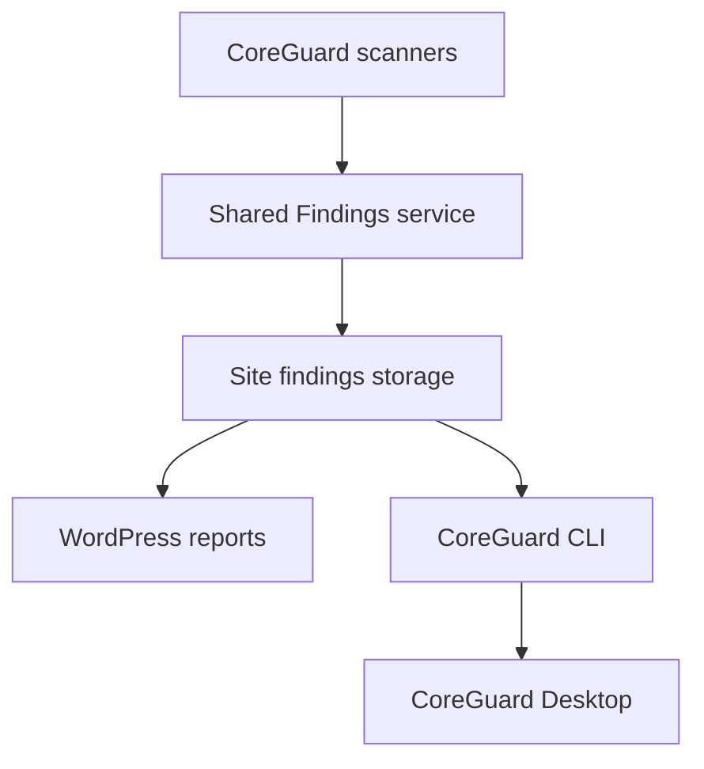
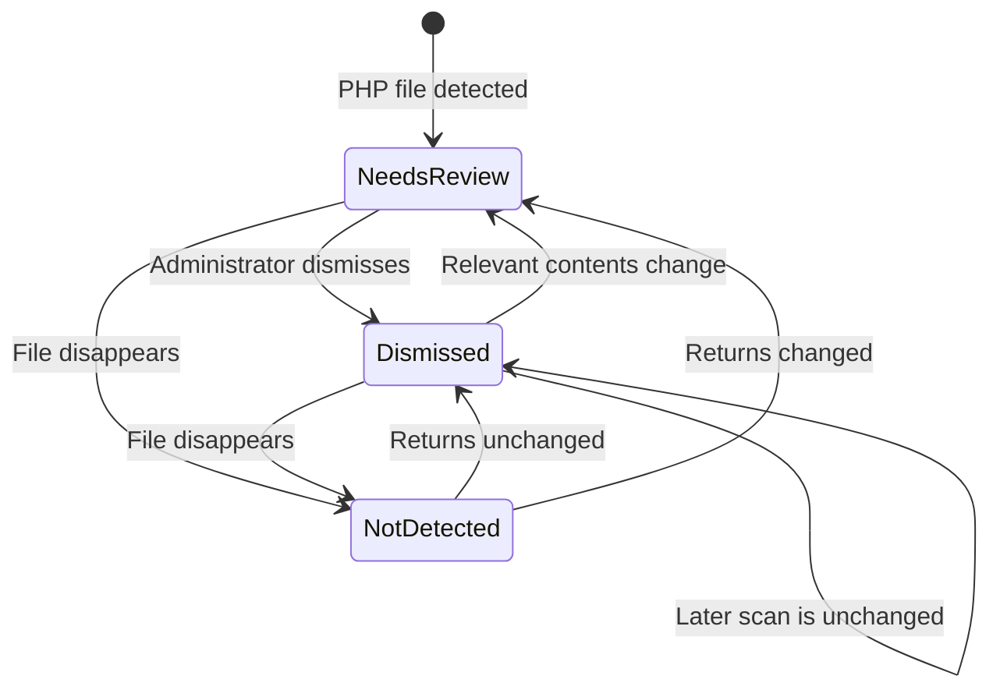

# CoreGuard Findings System

## Project Requirements Document

**Document status:** Finalized requirements — Phase 1/2, Phase **3.0**, **3.1**, **3.2**, **3.3**, and **3.4** (WP-Cron) complete (2026-07-20); Phase **3.5+** scanner migrations next; Phase 4/5 pending  
**Product scope:** Sassh WordPress Plugin (historical “CoreGuard” docs filenames), Sassh CLI, and future Sassh Desktop  
**Primary purpose:** Define a shared, persistent system for recording scan findings, presenting items for human review, preserving dismissals, and reopening findings when their relevant state changes.

**Scope of this document:** The Findings System — persistence, dismissals, effective status, object correlation, audit retention, scan-run attribution needed by future consumers, and the contract used by WordPress reports and future Desktop via CLI/JSON.

**Implementation status:** Phase 1, 2, **3.0**, **3.1**, **3.2**, **3.3**, and **3.4** are implemented in the plugin: persistence; Uploads + MU-Plugins + Verify Checksums + Exposed Files + Database options + WP-Cron Findings producers; Multisite Network Admin shell; centralized auth on all Sassh admin AJAX; network-option settings (Multisite fresh start); related-findings detail UI (hidden when empty); object types `option` and `cron_event`. Remaining Store-backed scanners migrate as Phase **3.5–3.7**; prototype store wind-down is Phase **3.8**.

**Future consumers (architecture must accommodate; not Phase 1/2/3.x delivery):** Scan Site aggregate runs, scheduled scans, email notifications, Home tab summary, Desktop orchestration, and new scanners such as Shell Scan. Early Findings phases must not expand into building those products.

**Canonical location:** This document under `docs/` is the formal Findings System contract. The working copy in `.cursor/plans/CoreGuard-Findings-System.md` should stay aligned; plans must not become a second conflicting source of truth.

---

## 1. Purpose

CoreGuard contains multiple security scans that report files, database objects, settings, vulnerabilities, scheduled events, and other conditions. Some results require human review, while others are displayed only for informational purposes.

Without a shared findings system, every scan risks implementing its own status handling, dismissal storage, identity rules, filters, and change detection. That would produce inconsistent behavior and make future integration with CoreGuard Desktop difficult.

The CoreGuard Findings System shall provide one common infrastructure that:

- Converts individual scan results into persistent findings.
- Distinguishes current scan observations from findings tracked over time.
- Allows CoreGuard to decide whether a finding needs review.
- Allows a site administrator to dismiss a finding after reviewing it.
- Preserves a dismissal while the relevant finding remains unchanged.
- Reopens a dismissed finding when a relevant change invalidates the earlier review.
- Records when findings were first seen, last seen, absent, and seen again.
- Correlates findings that refer to the same object across scanners without merging review decisions.
- Supplies consistent filters and detail information to all scan reports.
- Exposes findings through a stable CoreGuard CLI and versioned JSON contract.
- Supports a future multi-site CoreGuard Desktop application.

This is foundational infrastructure. New scans should use this system rather than create scan-specific dismissal mechanisms.

---

## 2. Product Context

CoreGuard is intended to operate in three related forms:

1. **CoreGuard WordPress Plugin** — Performs scans and provides security reports inside WordPress. The plugin must remain fully useful without Desktop.
2. **CoreGuard CLI** — Provides a machine-readable interface to scans, findings, and administrative actions. It is expected to run through WP-CLI and be accessible over SSH.
3. **CoreGuard Desktop** — A future application for monitoring and managing security across multiple sites. Desktop must also provide useful checks for sites that do not have the plugin installed.

When the plugin is installed, the site's findings database shall be authoritative. WordPress reports and Desktop shall display the same findings and review state.



Desktop shall communicate through CoreGuard CLI. It shall not scrape WordPress admin pages or depend directly on the plugin's database schema.

---

## 3. Core Concepts

### 3.1 Observation

An **observation** is something detected during one scan run. Observations are temporary scan output submitted to the Findings System.

Examples:

- An Uploads scan detects a PHP file.
- A database scan matches suspicious content in an option.
- A checksum scan detects a modified WordPress core file.
- A WP-Cron scan detects an unfamiliar scheduled hook.

Repeated observations may update the same persistent finding.

### 3.2 Finding

A **finding** is the persistent representation of a security-relevant or informational condition. It can be observed repeatedly across scan runs and retains its history and review state.

A scan result is therefore temporary evidence; a finding is the persistent record represented by that evidence.

### 3.3 CoreGuard classification

CoreGuard, not the site administrator, assigns one of these classifications:

| Machine value | User-facing label | Meaning |
| --- | --- | --- |
| `needs_review` | Needs Review | The finding requires human evaluation or possible action. |
| `no_action_needed` | Review Not Needed | The finding is included for information, context, or inventory and does not require human evaluation. |

The machine key `no_action_needed` is retained for compatibility with the existing plugin status system. The user-facing label is locked as **Review Not Needed** (not “No Action Needed” or “Review No Needed”), because the meaning is that the item is not in the human review queue — not that CoreGuard has declared the condition completely safe. Prototype UI strings that still say “No Action Needed” shall be updated to **Review Not Needed** when Findings UI / scanner reports are migrated (Phase 1/2 for shared status chrome; per-scanner surfaces as each migrates).

The site administrator shall not be provided controls to assign or switch between these classifications.

### 3.4 Canonical risk levels

CoreGuard uses five risk levels. The public field name is **`risk_level`**. Existing scanners that emit `risk` may use a temporary compatibility adapter while being migrated.

| Machine value | Label | Meaning | Semantic color |
| --- | --- | --- | --- |
| `critical` | Critical | High probability of malware. Requires immediate review. | Red |
| `warning` | Warning | A good chance of malware or another serious security problem. Requires prompt review. | Orange |
| `suspicious` | Suspicious | Unusual or potentially unsafe, but probably legitimate. Requires review. | Yellow |
| `info` | Info | Not considered a problem; shown for information or context. | Gray |
| `safe` | Safe | Recognized as expected or looking good. | Green |

Canonical severity order: `safe < info < suspicious < warning < critical`.

**Critical** does not mean “definitely malware.” CoreGuard is making a strong assessment, not a conclusive verdict; administrators may still review and dismiss Critical findings. Critical should be used sparingly and require strong evidence. A heuristic match with plausible legitimate explanations should normally be Warning or Suspicious.

Exact accessible color codes are a UI implementation decision. The interface must not communicate risk through color alone; labels and other indicators must remain present.

Legacy machine values such as `alert` and `review` are not part of the canonical set and must be mapped during each scanner’s migration (see inventory notes in planning docs).

### 3.5 Risk versus CoreGuard classification

`risk_level` and `coreguard_classification` remain independent fields. Scanners shall supply both (or accept the default mapping below).

Default risk → classification mapping:

| Risk | Default classification |
| --- | --- |
| Critical | `needs_review` |
| Warning | `needs_review` |
| Suspicious | `needs_review` |
| Info | `no_action_needed` |
| Safe | `no_action_needed` |

A scanner may override this default only for a documented scanner- or rule-specific reason.

Before or during each scanner’s migration, audit and document: current risk field name, current risk values, labels and colors, mapping to the canonical five levels, default classification, and any documented classification override. Uploads shall be standardized first as the reference Findings integration.

**Temporary compatibility adapters:** Until migration, existing `risk` field names and the prototype rule `risk === 'safe' → no_action_needed` (leaving `info` as Needs Review in current code) may remain. After a scanner migrates, it must use `risk_level`, the five canonical values, and the default mapping above unless a documented override applies.

### 3.6 Dismissal

A **dismissal** is a human review decision applied to a particular version of a finding that CoreGuard classified as Needs Review.

Dismissal means:

> I reviewed this particular version of this finding and do not currently need CoreGuard to keep presenting it for review.

Dismissal does not mean:

- Delete the finding.
- Stop scanning the object.
- Add a permanent path or value allowlist entry.
- Hide all future findings involving the same object.
- Change CoreGuard's underlying classification to Review Not Needed.
- Dismiss findings from other scanners that refer to the same object.

### 3.7 Effective status

The reports shall display one of the three CoreGuard effective status values:

| Machine value | User-facing label | Assigned by | Meaning |
| --- | --- | --- | --- |
| `needs_review` | Needs Review | CoreGuard | Human evaluation or action may be required. |
| `no_action_needed` | Review Not Needed | CoreGuard | The item is informational and does not require evaluation. |
| `dismissed` | Dismissed | Site administrator | The administrator reviewed the current version of a Needs Review finding and dismissed it. |

These values are not three interchangeable user choices. Dismissed is a human override layered over the CoreGuard classification — not a scanner-assigned classification.

Effective status shall be calculated as follows:

```text
If the CoreGuard classification is Review Not Needed (no_action_needed):
    Display Review Not Needed
Else if a valid dismissal exists for the current finding version:
    Display Dismissed
Else:
    Display Needs Review
```

An **Accepted** status is not part of Phase 1/2 (see §20).

### 3.8 Detection state

Review status and detection state are separate concepts. A finding may be:

- **Active** — Detected in the latest applicable completed scan.
- **No Longer Detected** — Previously detected but absent from the latest applicable completed scan.

The database should preserve findings that are no longer detected so CoreGuard can retain history and recognize later reappearance.

### 3.9 Site Identity and security scope

For a normal single-site WordPress installation, the CoreGuard security boundary is the WordPress installation:

```text
CoreGuard security scope = installation_id
```

Findings and object correlation must never cross different WordPress installations.

The exact format, creation, storage, migration, restoration, and cloning behavior of `installation_id` belong in the future **Site Identity** specification. This Findings PRD and Phase 1/2 plans must not silently invent those mechanics. Desktop may expose an installation-level `site_id` synonymous with `installation_id` once that spec lands.

If the term `site_scope_id` appears in architecture notes, it means the **installation/network security boundary** (`installation_id`), not a separate CoreGuard instance per blog.

### 3.10 WordPress Multisite (network-wide CoreGuard)

On WordPress Multisite, CoreGuard operates as a **network-wide** security tool, not as separate CoreGuard installations per subsite.

Locked requirements:

- CoreGuard / Sassh should be network-activated on Multisite.
- Only WordPress Super Administrators may access Sassh Findings and network-wide security reports.
- Ordinary subsite administrators do not receive separate Sassh Findings access, even when they possess `manage_options` on a subsite.
- **Authorization rule (centralized, e.g. `Sassh_Capabilities::current_user_can_manage()`):**
  - Single-site WordPress: require `manage_options`.
  - WordPress Multisite: require a network-level capability such as `manage_network_options` (Super Administrators).
  - State-changing WordPress admin actions also require nonce verification in both modes.
- Apply the same authorization boundary to viewing reports/findings, listing/retrieving findings, running scans that persist Findings, dismissing, undoing dismissals, and any other network-wide Findings action.
- On Multisite, network-wide Sassh reports must be registered under **Network Admin**, not exposed through individual subsite admin dashboards. Ordinary subsite administrators must not receive Findings access (including via direct AJAX). Phase **3.0** registers the full Sassh UI under Network Admin and requires `Sassh_Capabilities` on all Sassh admin handlers.
- The Multisite network has one Sassh dashboard under Network Admin.
- The network has one shared findings, dismissal, and audit store.
- Shared WordPress core, plugin, theme, MU-plugin, and configuration files are scanned and reported once.
- A dismissal applies network-wide to that specific finding and reviewed fingerprint.
- Database, post, option, uploads, and other **subsite-owned** findings identify their originating blog/subsite.
- `blog_id` becomes part of the **normalized object identity** for subsite-owned objects (not a separate CoreGuard security scope).
- CoreGuard will not implement per-subsite findings permissions, separate subsite dashboards, or separate subsite dismissal stores.
- Findings and correlation must never cross into another WordPress installation or Multisite network.

```text
Multisite network security scope = installation_id
```

Identity examples (canonical tuples; not naïve string concatenation):

```text
Shared file:
  installation_id + scanner_id + object_type:file + normalized_file_path

Subsite-owned database object:
  installation_id + scanner_id + object_type + blog_id + normalized_object_key
```

**Phase 3.4.5:** `rule_id` is **not** part of Finding identity. Multiple rules on one object are **categories** on one Finding (see §5.2).

Examples of normalized keys including blog identity: `blog:2 + option:siteurl`, `blog:3 + post:42`.

Object correlation for shared files uses installation + object type + path. Object correlation for subsite-owned objects includes `blog_id` in the object key so blog 2’s `siteurl` does not correlate with blog 3’s `siteurl`.

### 3.11 Object correlation (not cross-scan suppression)

Findings and dismissals remain **scanner-specific**. Dismissing a Finding for an object does not dismiss another scanner’s Finding for the same object.

**Phase 3.4.5:** Within one scanner, multiple rules on the same object are **categories** of one Finding — not separate dismissible Findings. Object-level dismissal applies to the Finding’s aggregate reviewed state (see §5 / §7).

CoreGuard shall also maintain an **object correlation key** so that related findings can be discovered and shown as context:

```text
Shared file object correlation:
  installation_id + object_type + normalized_object_key

Subsite-owned object correlation:
  installation_id + object_type + blog_id + normalized_object_key
```

Conceptual layers:

```text
Security scope         = installation_id
Finding identity       = installation_id + scanner_id + object_type + (blog_id if subsite-owned) + normalized_object_key
Object correlation     = installation_id + object_type + (blog_id if subsite-owned) + normalized_object_key
Categories             = rule_id rows under the Finding (evidence / risk / fingerprints; not independently dismissible)
Object fingerprint     = whole-object version; used for related-finding context
Finding review fingerprint = composite of active category fingerprints + object fingerprint + aggregate risk; dismissal validity
Review decision        = applies to the Finding (network-wide for that finding)
```

Identity and correlation formulas represent **canonical tuples**, not naïve string concatenation. The implementation must use separately stored normalized fields or an unambiguous canonical encoding before hashing. It must not concatenate variable-length values without defined separators, escaping, or length encoding.

Example:

1. MU-Plugins reports `wp-content/mu-plugins/example.php` and the administrator dismisses that Finding.
2. Exposed Files later reports a different scanner Finding on a shared path.
3. The Exposed Files Finding remains Needs Review.
4. Related Findings may indicate the MU-Plugins Finding was dismissed while the object fingerprint matched.

A future explicit `review_scope_id` or rule-equivalence group may allow shared review across scanners for rules that genuinely represent the same condition. Sassh must never infer cross-scanner equivalence merely because two Findings reference the same path or object.

---

## 4. Functional Requirements

### 4.1 Shared service

All participating scanners shall submit normalized observations to a shared Findings service. Individual scanners shall not independently implement persistent identities, dismissals, effective statuses, or reopening logic.

The service shall be responsible for:

- Matching an observation to an existing finding or creating a new finding.
- Maintaining first-seen and last-seen timestamps.
- Tracking the last applicable scan.
- Comparing current and previously reviewed finding fingerprints.
- Storing object correlation keys and object fingerprints.
- Querying related findings for correlation context.
- Calculating effective status.
- Creating and invalidating dismissals.
- Marking missing findings as no longer detected only after a successful applicable scan completes.
- Recognizing reappearance.
- Preserving finding and review history, including legacy review history from prior storage formats.
- Supporting common filters and counts.
- Returning normalized records to the WordPress UI and CoreGuard CLI.

Conceptual service operations may include:

```php
record_observation( $observation );
complete_scan( $scanner_id, $scan_id );
dismiss( $finding_id, $reviewed_fingerprint, $actor );
undo_dismissal( $finding_id, $actor );
get_effective_status( $finding );
list_findings( $filters );
get_finding( $finding_id ); // may include related_findings summary
list_related_findings( $finding_id );
```

These are conceptual requirements, not mandatory PHP method names.

### 4.2 Scan completion safety

A failed, interrupted, timed-out, or partially completed **scanner execution** shall not cause previously detected findings for that scanner to be marked No Longer Detected.

Only successful completion of a scanner execution with a defined scope may establish that an applicable finding was absent.

One scanner must never mark another scanner’s findings absent. In an aggregate Scan Site run, each scanner’s completion is evaluated independently (see §11).

### 4.3 Common report behavior

Participating reports shall consistently support, as applicable:

- Effective-status display using the labels in §3.6.
- Risk-level display.
- Needs Review, Review Not Needed, and Dismissed filters.
- Active and No Longer Detected filters.
- Finding details.
- First seen and last seen.
- Dismiss action for eligible findings.
- Undo dismissal or Return to Needs Review action for dismissed findings.
- An indication when a prior dismissal was invalidated and why.
- Related-findings context in the detail panel when a second participating file scanner exists (see §5.7); not required during the Uploads-only reference phase.

A finding classified as Review Not Needed shall normally have no Dismiss control because CoreGuard is not requesting human review.

### 4.4 Clear History, baselines, and audit retention

The audit system shall preserve invalidated and undone dismissal history. Routine operations must not silently erase that history.

The existing **Clear History** control was created to support prototype comparison workflows and today clears dismissal registry buckets and cached scan reports. It was **not** intended to manage permanent findings or security audit records. The persistent Findings System makes the old baseline mechanism and its Clear History control obsolete for migrated scanners.

Locked decisions:

- Remove the legacy baseline and Clear History control as each affected scan migrates to the Findings System.
- Do **not** reproduce a general Clear History control in the new Findings System.
- Do **not** allow the old control to delete new findings, dismissals, or audit records.
- Before a scanner is migrated, its current baseline behavior may remain temporarily if required by existing code.
- After migration, the scanner relies on persistent findings, fingerprints, first/last seen, detection state, and audit history.
- Do **not** invent purge, reset, or delete-history controls unless a real product need is identified later.

---

## 5. Finding Identity, Object Correlation, and Versioning

### 5.1 Identity and version must be separate

A finding identity answers:

> Is this the same logical finding that CoreGuard detected previously?

A finding (content) fingerprint answers:

> Is this still the same relevant version that the administrator reviewed?

The current finding fingerprint shall not be embedded in the permanent finding identity. Otherwise, every content change would create an unrelated finding and lose continuity.

### 5.2 Identity components

A normalized identity key should be derived from the canonical tuple:

```text
installation_id + scanner_id + object_type + (blog_id if subsite-owned) + normalized_object_key
```

**Phase 3.4.5 (locked):** `rule_id` is **not** part of Finding identity. One Finding is one scanner’s assessment of one object. Fired rules are stored as **categories** (`sassh_finding_categories`) under that Finding.

The stored `finding_id` may be an opaque identifier. The implementation should also enforce uniqueness for the normalized identity components where appropriate. Canonical encoding rules in §3.11 apply.

Consequences:

- Same object, same scanner, unchanged review fingerprint: same Finding and same reviewed version.
- Same object, same scanner, changed review fingerprint: same Finding with a new reviewed version.
- Same object, multiple rules in one scanner: **one** Finding with multiple categories (not separate Findings).
- Same object, different scanner: separate Findings (Related Findings may link them).
- Different normalized object key: normally a different Finding.
- Categories are not independently user-dismissible; dismissal is object-level for the Finding.

### 5.3 Object type registry

`object_type` values shall be **coarse and shared** across scanners (for example `file`, `option`, `post`). CoreGuard shall maintain an **object-type registry** documenting allowed types and each type’s key normalization rules.

Scanner-specific meaning remains in `scanner_id`, `rule_id`, and metadata — not in `object_type`. Scanner-private types such as `mu_plugin_file` versus `uploads_php_file` for the same path must not be used for correlation, because they would prevent related-findings lookup.

### 5.4 Normalized object keys for files

All in-root file scanners must use a **shared normalization utility** that produces WordPress-root-relative paths with:

- Forward slashes.
- No leading slash.
- No `./` segments.
- No unresolved dot segments.
- Case preserved.
- No absolute server paths.

Example: `wp-content/mu-plugins/example.php`.

Files outside the WordPress root require a separately defined namespace later and are out of scope for initial correlation.

### 5.5 Object fingerprint versus finding fingerprint

The system shall store both fingerprints and keep the fields separate even when their values initially match.

| Fingerprint | Purpose | Typical file input |
| --- | --- | --- |
| **Object fingerprint** | Related-finding context (“same object version”) | SHA-256 of the entire file |
| **Finding fingerprint** (`content_fingerprint`) | Dismissal validity (“version the administrator reviewed”) | Rule-specific inputs for what that rule reviewed |

Dismissal validity uses the rule-specific finding fingerprint. Related-finding context compares object fingerprints.

### 5.6 Object identity examples

| Object type | Possible normalized object key | Object fingerprint (typical) | Finding fingerprint (typical) |
| --- | --- | --- | --- |
| `file` | Root-relative normalized path | SHA-256 of entire file | Rule-specific (may equal whole-file hash for simple presence rules, or include matched evidence inputs) |
| `option` | Option name (exact); `active_plugins#path` for list entries; synthetic `home+siteurl` for the composite mismatch rule | SHA-256 of raw option value(s) | Rule-specific value/state hash; pattern rules use full option value |
| `post` | Post ID plus field or matched location per registry | Documented post/state hash | Relevant field content or fragment per rule |
| `cron_event` | `hook#` + digest of canonicalized args (no timestamp); typed canonicalization preserves PHP types and indexed-array order | SHA-256 of hook + canonical args + sorted unique schedule/interval pairs | Rule-specific (e.g. overdue boolean for `stale-task`; threshold-family sentinel for `duplicate-task`; full args + signals for `suspicious-arguments`) |

Each scanner integrated with the system shall document its object-key normalization and finding-fingerprint inputs. Object-type registry entries document shared key rules.

### 5.7 Related findings context

**Phase 1 (required):** Correlation storage, queries, and tests.

**Phase 2 (Uploads-only):** Related-findings UI not required. Correlation keys and object fingerprints are still stored.

**Phase 3.0:** Detail-panel related UI ships (load on row expand; cap 10; hidden when empty). Uploads and MU-Plugins directory scopes are mutually exclusive, so they do not naturally populate related context.

**Phase 3.2:** Exposed Files (`exposed-files`) is the first practical related-findings peer with Verify Checksums on shared ABSPATH-root file paths (same `object_type=file` + normalized `object_key`). Uploads does not share paths with Exposed Files on standard layouts. Related list excludes the current finding; dismissals never inherit across scanners.

**Phase 3.3:** Database options (`database-scan`) registers `object_type=option` (first non-file Findings type). Identity includes a required registered-site `blog_id`. Related-on-expand is wired; natural cross-scanner peers for options are uncommon until later phases. Same-option multi-rule rows within this scanner may correlate.

**Phase 3.4:** WP-Cron (`scheduled-tasks`) registers `object_type=cron_event`. Identity includes required registered-site `blog_id` (same options-table gate as 3.3). Recognized-only events are report inventory only. *(Historical note: Phase 3.4 originally emitted one Finding per problem-rule; Phase **3.4.5** superseded that with object-level Findings + categories.)*

**Phase 3.4.5:** Object-level Findings across all migrated scanners. Admin Related Findings show **cross-scanner** peers only; same-scanner multi-rule reasons appear as categories (`+N` / detail). Structured guidance composition replaces concatenated per-rule paragraphs.

**CLI/JSON (Phase 4):** Include related context on `findings get`. Do not include related findings in list responses by default. Public envelope uses object-level Findings with `categories[]`.

Related summary requirements:

- Cap at **10** items.
- Include **active** and **No Longer Detected** findings.
- No raw evidence or payloads.
- Object fingerprint comparison: `same` | `different` | `unknown`.
- Deterministic sort prioritizing: matching object fingerprints, then active findings, then most recently seen.

Suggested detail copy when a related finding was dismissed with a matching object fingerprint:

> This file was previously reported by {scanner} and dismissed while its contents had the same fingerprint.

### 5.8 Fingerprint format requirements

Fingerprints shall be deterministic for the relevant state being reviewed. They should exclude incidental metadata that does not change the security meaning, such as a filesystem modification timestamp when file contents are unchanged.

Fingerprints exposed through CLI or stored in dismissal records should identify their algorithm, for example:

```text
sha256:012345...
```

Sensitive contents shall not need to be exposed to Desktop merely to verify a fingerprint.

---

## 6. Required Finding Record

The internal persistence model shall support at least the following logical fields. Physical table names and column organization may differ.

```text
finding_id
installation_id               # security scope; Site Identity spec defines representation
blog_id                       # required for subsite-owned objects; null/absent for shared network objects
scanner_id
rule_id
object_type
object_key
object_correlation_key
identity_key
title
description
risk_level                    # critical|warning|suspicious|info|safe
coreguard_classification
content_fingerprint           # finding / rule-specific fingerprint
object_fingerprint
rule_fingerprint or rule_version
first_seen_at
last_seen_at
last_scanner_execution_id     # last scanner execution that observed this finding
last_scan_run_id              # parent aggregate Scan Site run when applicable; nullable
detection_state
metadata
created_at
updated_at
```

Requirements:

- `finding_id` shall be stable for the life of the logical finding.
- `installation_id` is the CoreGuard security scope (§3.9–§3.10). Exact representation is defined by the Site Identity specification.
- `blog_id` identifies originating subsite for subsite-owned objects; shared files/config do not invent per-blog duplicates.
- `scanner_id` and `rule_id` shall be stable machine identifiers, not display labels.
- `object_type` and `object_key` shall follow the object-type registry and shared normalization rules.
- `object_correlation_key` shall derive from the canonical correlation tuple in §3.11.
- `identity_key` may be a hash of the finding identity canonical tuple.
- `risk_level` shall use the five canonical values in §3.4.
- `coreguard_classification` shall use `needs_review` or `no_action_needed`.
- `content_fingerprint` shall represent the current rule-specific reviewed version.
- `object_fingerprint` shall represent the current whole-object version used for correlation context.
- `last_scanner_execution_id` / `last_scan_run_id` support future aggregate and scheduled Scan Site attribution (§11) without requiring those UIs in Phase 1/2.
- `metadata` may carry scan-specific structured data (including heuristic fields such as `family`, `pack_id`, nested `evidence`) but shall not replace common fields needed for filtering.
- Timestamps exposed across interfaces shall use an unambiguous standard such as UTC ISO 8601.

The initial WordPress implementation should use purpose-built custom database tables rather than accumulating large serialized finding collections in `wp_options`.

---

## 7. Dismissal and Audit Records

### 7.1 Required dismissal data

A dismissal record shall support:

```text
dismissal_id
finding_id
reviewed_fingerprint
dismissed_at
actor_type
actor_identifier
action_source
reason or note
invalidated_at
invalidation_reason
created_at
updated_at
```

The initial UI may defer optional reasons or notes, but storage should accommodate them without redesigning the identity model.

Possible future dismissal reasons include:

- Known legitimate.
- False positive.
- Expected configuration.
- Other.

### 7.2 Actor and source

The system shall distinguish actions made through WordPress from actions made through Desktop.

Examples:

```text
actor_type: wordpress_user
actor_identifier: 42
action_source: wordpress_admin
```

```text
actor_type: desktop_user
actor_identifier: <local CoreGuard profile or installation identifier>
action_source: coreguard_desktop
```

An SSH identity shall not automatically be represented as a WordPress user.

### 7.3 Append-only dismissal decisions

Dismissal history must support multiple review cycles for the same finding.

- Each dismissal action creates a **new** dismissal or review-decision record.
- Invalidating or undoing a dismissal **terminates** that decision but does not overwrite, reactivate, or delete it.
- A finding may have multiple historical dismissal records but **no more than one currently valid** dismissal.
- Do **not** implement dismissal storage as one mutable row whose prior values are overwritten.

Example:

```text
Version A is dismissed.                         → decision record 1 (valid)
Version B invalidates that dismissal.           → record 1 terminated; audit retained
Administrator dismisses version B.              → decision record 2 (valid)
Both decisions remain available in audit history.
```

CoreGuard shall preserve enough history to explain events such as:

```text
July 10: Finding first detected
July 11: Finding dismissed by administrator
July 18: Relevant contents changed
July 18: Dismissal invalidated; finding returned to Needs Review
July 18: Finding dismissed again at new fingerprint
```

### 7.4 Prototype data and legacy migration

CoreGuard currently has no external users. Preserving prototype baselines and path-only dismissals is **not** a product requirement.

Locked decisions:

- Do **not** migrate old comparison baselines into the Findings System.
- Do **not** migrate legacy path-only dismissals into active fingerprint-bound dismissals.
- Start the new Findings System with **fresh** findings and review decisions.
- It is acceptable for previously dismissed prototype items to return to Needs Review once.
- Obsolete prototype data may be removed after the new system is verified and an appropriate development backup exists.
- Do **not** build an elaborate legacy migration system solely for current private test data.
- Current contents must **never** be retroactively represented as contents previously reviewed by the administrator.

**Unsafe (forbidden):** Hashing an object’s current contents at migration/cutover time and treating that hash as the reviewed fingerprint.

---

## 8. Dismissal Eligibility and Reopening

### 8.1 Valid dismissal

A dismissal is valid only when:

- The finding's CoreGuard classification is Needs Review (`needs_review`).
- The finding is in a state eligible for dismissal.
- The dismissal's reviewed fingerprint matches the finding's current finding fingerprint (`content_fingerprint`).
- No later event has invalidated the dismissal.

### 8.2 Reopening conditions

A dismissed finding shall return to Needs Review when:

- Its relevant finding fingerprint changes.
- Its normalized object identity changes in a way that results in a new finding.
- Its risk level increases materially.
- A materially changed rule invalidates prior review decisions.
- The administrator undoes the dismissal.
- Another scanner-specific condition documented as review-invalidating occurs.

A dismissed finding shall not reopen solely because:

- Another scan ran.
- `last_seen_at` changed.
- An incidental filesystem timestamp changed while relevant contents did not.
- A rule implementation changed without changing the rule's security meaning.
- A different scanner reported the same object (that creates or updates a separate finding; it does not reopen or suppress this one by itself).

### 8.3 Classification-transition behavior

When a finding’s CoreGuard classification changes:

- If the finding changes from `needs_review` to `no_action_needed`, invalidate any currently valid dismissal and preserve it in audit history with an appropriate classification-change reason.
- If the finding later changes from `no_action_needed` back to `needs_review`, its effective status must be **Needs Review**. The old dismissal must **not** become valid again automatically. A new human dismissal is required.

### 8.4 Rule changes

`rule_version` by itself should not automatically reopen every dismissal. The system shall support a rule fingerprint, review-compatibility version, or equivalent mechanism that changes only when the meaning of the reviewed condition has changed materially.

### 8.5 Disappearance and reappearance

Initial required behavior:

- When an active finding is absent from a successfully completed applicable scan, mark it No Longer Detected.
- Preserve its finding and dismissal history.
- If it returns with the same identity and finding fingerprint, restore Active detection state and preserve the valid dismissal.
- If it returns with a different finding fingerprint, restore Active detection state and display Needs Review.

The history shall show that the finding disappeared and reappeared.

---

## 9. Site Administrator Experience

### 9.1 Available administrator actions

The site administrator may:

- Inspect finding details.
- Select **Dismiss this item** for an eligible Needs Review finding.
- Undo a dismissal or select **Return to Needs Review** for a dismissed finding.
- Filter reports by effective status and detection state.

The site administrator may not directly assign Needs Review or Review Not Needed.

### 9.2 Dismissal confirmation

The interface should communicate that dismissal applies to the current version and that CoreGuard will report the item again if relevant information changes.

Suggested explanatory text:

> Dismiss this version of the finding. CoreGuard will continue scanning it and will return it to Needs Review if its relevant contents or risk change.

### 9.3 Dismissal failure after concurrent change

The UI shall send the finding fingerprint of the version shown to the administrator. If the underlying finding changes before the dismissal is saved, the operation shall be rejected rather than dismissing unseen content. The interface shall refresh the finding and explain that it changed and must be reviewed again.

### 9.4 Default report behavior

The normal report view should emphasize active Needs Review findings. Dismissed and Review Not Needed findings shall remain accessible through filters and counts rather than being deleted or permanently hidden.

---

## 10. Scanner Integration Contract

Every participating scanner shall provide, for each observation:

```text
scanner_id
rule_id
object_type                    # from object-type registry
normalized_object_key          # shared normalizer for that type; include blog_id for subsite-owned objects
title
description
risk_level                     # critical|warning|suspicious|info|safe
coreguard_classification       # needs_review | no_action_needed (or omit to use default mapping)
content_fingerprint            # finding / rule-specific
object_fingerprint             # whole-object; for files normally entire-file SHA-256
rule_fingerprint or review-compatibility version
scanner-specific metadata      # may include heuristic family, pack_id, evidence, etc.
```

Every scanner integration shall document:

1. What constitutes the same logical finding.
2. How the object key is normalized (must match the registry / shared utility; Multisite blog ownership rules).
3. Which inputs are included in the finding fingerprint.
4. How the object fingerprint is computed for its object type.
5. Which changes must reopen a dismissal.
6. The scope of a completed scanner execution used to mark findings absent.
7. Mapping from any legacy risk values to the canonical five levels.
8. Default classification and any documented classification overrides.

Scanners shall not:

- Write dismissal records directly.
- Calculate effective status independently.
- Treat a dismissed path as a permanent allowlist entry.
- Mark other scanners' findings absent.
- Mark findings absent after an unsuccessful scan.
- Infer that dismissing one finding dismisses another on the same object.

---

## 11. Initial Reference Integration

The Uploads scan should be the first reference implementation because it has clear file identities, straightforward content hashing, and an obvious dismissal/reopening lifecycle.

Findings System delivery for Phase 1/2 means persistence plus Uploads as the first producer. Phase **3.0** adds MU-Plugins and the Network Admin shell. Migrating remaining existing scans is Phase **3.1+** (see §18); building new scanners remains separate work that must consume the same service.

Example observation:

```json
{
  "scanner_id": "uploads",
  "rule_id": "php-file-in-uploads",
  "object_type": "file",
  "object_key": "wp-content/uploads/2026/07/example.php",
  "risk_level": "warning",
  "coreguard_classification": "needs_review",
  "content_fingerprint": "sha256:...",
  "object_fingerprint": "sha256:..."
}
```

Expected lifecycle:



After the Uploads integration is proven, remaining existing scans migrate onto the shared service as **Phase 3.x** slices (see §18). Locked order:

1. **3.0 (done):** MU-Plugins (and Network Admin / related UI).
2. **3.1 (done):** Core checksum findings (`verify-checksums`).
3. **3.2:** Exposed sensitive-file findings (practical related-findings peer with Verify Checksums on ABSPATH-root files).
4. **3.3 (done):** Database options findings (`object_type` registry: `option`).
5. **3.4 (done):** WP-Cron findings (`cron_event`).
6. **3.5:** Vulnerability / unrecognized-component findings.
7. **3.6:** Directory Browsing — configuration/exposure object type (not forced `file`).
8. **3.7 (optional):** wp_posts (Store-backed; outside the original §11 list).
9. **3.8:** Prototype `Finding_Status_Store` wind-down after the last migrated scan; leftover **Review Not Needed** string sweep.

Object-type registry entries expand **inside** the phase that first needs them. Future heuristic scans remain separate projects once they exist.

The exact order of 3.1–3.7 may be adjusted with justification, but each migration must use the common service. During migration, remove that scanner’s Clear History control and baseline dependency per §4.4.

---

## 12. Future Scan Site, scheduling, notifications, and Home

These capabilities are **future consumers** of the Findings System. Phase 1/2 must accommodate them architecturally and must **not** implement their UIs, schedulers, or email delivery.

### 12.1 Aggregate Scan Site versus individual scans

CoreGuard will eventually provide a single **Scan Site** button. Administrators may:

- Run Scan Site to execute all applicable scanners.
- Continue running individual scans selectively.
- View findings from either type of scan through the **same** Findings System.

An aggregate Scan Site operation and an individual scan must not create separate finding systems. Both update the same persistent findings.

Distinguish:

| Concept | Meaning |
| --- | --- |
| Aggregate scan run | One Scan Site operation |
| Scanner execution | One scanner within that aggregate run or run independently |
| Observation | Something detected by that scanner execution |
| Finding | Persistent condition updated by observations over time |

Observations must be attributable to their scanner execution and, when applicable, their parent aggregate Scan Site run.

Illustrative scan-run fields (not a frozen persistence schema):

```text
scan_run_id
run_type: full | individual
run_source: wordpress_admin | scheduled | coreguard_cli | coreguard_desktop
started_at
completed_at
completion_status
included_scanners
successful_scanners
failed_scanners
```

### 12.2 Partial Scan Site failures

Each scanner’s completion is evaluated independently. If an aggregate run includes five scanners and one fails:

- The overall run may be reported as partially completed.
- Successful scanners may update their findings normally.
- The failed scanner must not mark any of its previous findings No Longer Detected.
- One scanner must never mark another scanner’s findings absent.
- The interface must make incomplete or failed scanner coverage visible.

### 12.3 Scheduled scans

CoreGuard will eventually run Scan Site automatically (for example every 24 hours). A scheduled Scan Site uses the same scan-run and Findings infrastructure as a manual Scan Site (`run_source = scheduled`). Scheduling initiates the scan; it must not create a separate findings or dismissal system.

Exact scheduling technology, frequency controls, retry, locking, timeout, and WP-Cron reliability strategy are future requirements outside Phase 1/2.

### 12.4 Email notifications

After scheduled scans exist, CoreGuard should email administrators about important active findings. Direction:

- Focus on Critical and Warning findings.
- Valid dismissed findings should not continue generating notifications.
- A finding whose dismissal is invalidated becomes eligible again.
- Avoid repetitive daily alerts for the same unchanged review-relevant version.

Notify when an active Critical or Warning finding is newly detected, reappears after absence, reopens because its finding fingerprint changed, materially increases to Warning or Critical, or has not already been reported for its current review-relevant version.

The Findings System records lifecycle state needed by notifications. It is **not** the email-delivery service. Recipients, templates, frequency, reminders, delivery tracking, and configuration are product decisions deferred until **after** the Findings System is fully implemented; they must not block Phase 1/2.

### 12.5 Home tab summary

The Home tab will eventually show results of the latest Scan Site operation, including: run date/time; success / partial / failed; which scanners succeeded or failed; active Critical, Warning, and Suspicious counts; new or reopened findings; dismissed findings; and links to detailed findings.

Home must not present a reassuring summary without disclosing failed or incomplete scanner coverage. Individual scans after the last Scan Site still update the shared Findings System.

Architectural preference: show **current** findings state while clearly identifying the date, completeness, and outcome of the latest full Scan Site operation. Exact snapshot-versus-current presentation is a product decision deferred until **after** the Findings System is fully implemented; it must not block Phase 1/2 or later scanner migrations onto Findings.

### 12.6 Minimum Phase 1/2 attribution (do not build orchestration yet)

To avoid blocking §12.1–§12.5, Phase 1/2 persistence should support at least:

- Attributing each observation/finding update to a **scanner execution** id (even when the “run” is a single individual scan).
- Optional nullable **parent aggregate `scan_run_id`** (null for individual-only executions until Scan Site exists).
- Per-scanner completion success/failure used for absence marking (§4.2).
- Finding lifecycle fields needed later by notifications and Home: first/last seen, detection state, risk_level, effective status, fingerprints, dismissal validity.

Phase 1/2 must **not** build: Scan Site button, aggregate orchestration UI, scheduler, email delivery, notification settings, Home summary, Desktop scan orchestration, or new scanners such as Shell Scan.

---

## 13. CoreGuard CLI Requirements

### 13.1 Purpose

CoreGuard CLI shall expose findings to CoreGuard Desktop and automation without exposing the plugin's internal storage schema.

Conceptual commands include:

```bash
wp coreguard findings list --format=json
wp coreguard findings get <finding-id> --format=json
wp coreguard findings dismiss <finding-id> --fingerprint=<reviewed-fingerprint> --source=desktop
wp coreguard findings undismiss <finding-id> --source=desktop
```

These command names are illustrative. Final names shall follow the broader CoreGuard CLI command conventions.

Draft CLI docs that describe a free-form `findings set-status` with an **Accepted** status are superseded for the initial version: use fingerprint-gated dismiss / undismiss (or equivalent) only. Administrators must not assign CoreGuard classifications through CLI.

### 13.2 CLI behavior

The CLI shall:

- Return versioned structured JSON using one common finding envelope (§13.3).
- Support filtering and pagination for large finding sets.
- Return stable machine identifiers separately from display labels.
- Return meaningful machine-readable errors.
- Require the reviewed finding fingerprint when dismissing a finding.
- Reject dismissal when the submitted fingerprint does not match the current finding.
- Return or identify the updated finding when a stale dismissal is rejected.
- Include related-findings summary on `findings get`; omit related findings from list responses by default.
- Enforce appropriate authorization within the WP-CLI/SSH execution context.
- Avoid exposing unnecessary sensitive file or database contents.

### 13.3 Common public finding envelope

There is one public finding shape for all scanners. Heuristic fields such as `family`, `pack_id`, and `evidence` belong inside that envelope (for example under `evidence` / `scanner_metadata`), not as a second incompatible finding type.

Illustrative representation (not yet the frozen schema):

```json
{
  "schema_version": "1.0",
  "finding_id": "cgf_...",
  "site_id": "cgs_...",
  "scanner_id": "uploads",
  "rule_id": "php-file-in-uploads",
  "object": {
    "type": "file",
    "key": "wp-content/uploads/2026/07/example.php"
  },
  "risk_level": "warning",
  "coreguard_classification": "needs_review",
  "effective_status": "dismissed",
  "content_fingerprint": "sha256:...",
  "object_fingerprint": "sha256:...",
  "first_seen_at": "2026-07-10T14:30:00Z",
  "last_seen_at": "2026-07-16T20:15:00Z",
  "detection_state": "active",
  "dismissal": {
    "dismissed_at": "2026-07-12T18:45:00Z",
    "reviewed_fingerprint": "sha256:...",
    "action_source": "coreguard_desktop"
  },
  "evidence": [],
  "scanner_metadata": {},
  "related_findings": [
    {
      "finding_id": "cgf_...",
      "scanner_id": "mu-plugins",
      "rule_id": "...",
      "title": "...",
      "effective_status": "dismissed",
      "detection_state": "active",
      "object_fingerprint_comparison": "same",
      "dismissed_at": "2026-07-11T12:00:00Z"
    }
  ]
}
```

`related_findings` appears on get responses as specified in §5.7; list responses omit it by default.

The final JSON schema shall define required fields, nullable fields, enums, pagination, error envelopes, and compatibility behavior in [CoreGuard JSON Schema.md](CoreGuard%20JSON%20Schema.md) and [CoreGuard CLI API.md](CoreGuard%20CLI%20API.md).

---

## 14. CoreGuard Desktop Requirements

### 14.1 Plugin-installed sites

When the plugin is installed:

- The site's plugin-managed findings store shall be authoritative.
- Desktop shall retrieve findings through CoreGuard CLI over SSH.
- Desktop may cache results for performance and offline reference.
- The Desktop cache shall not become a competing source of truth.
- A dismissal made in Desktop shall be written back to the site.
- A dismissal made in WordPress shall appear in Desktop after refresh.
- Reopening on the site shall appear in both interfaces.

Typical flow:

1. Desktop requests current findings.
2. The plugin returns versioned JSON through CLI.
3. Desktop updates its local cache.
4. The user reviews and dismisses a finding in Desktop.
5. Desktop sends the finding ID and reviewed fingerprint to the site.
6. The site validates and records the dismissal.
7. Desktop refreshes the authoritative result.

### 14.2 Plugin-free sites

CoreGuard Desktop must also support useful checks for sites without the plugin. In this mode:

- Desktop may execute checks through SSH and WP-CLI.
- Desktop shall maintain its own local findings repository.
- Desktop-produced findings shall follow the same identity, classification, fingerprint, dismissal, and reopening model where applicable.
- Desktop shall clearly distinguish plugin-produced findings from Desktop-produced findings.

### 14.3 Transition after plugin installation

If Desktop has historical findings for a plugin-free site and the plugin is later installed:

- The plugin shall become authoritative for plugin-produced findings.
- Existing Desktop-only history may be retained locally.
- Desktop shall not silently upload old dismissals or convert them into plugin dismissals.
- Reconciliation may be added later as an explicit, validated feature.

This avoids treating findings from different scanner or rule versions as equivalent without proof.

---

## 15. Site Identity

Desktop will manage multiple WordPress installations. Every finding exposed to Desktop must be scoped to a stable CoreGuard **installation** identifier (`installation_id` / `site_id`).

Requirements deferred to the Site Identity specification (do not invent in Phase 1/2):

- Format, creation, storage, migration, restoration, and cloning of `installation_id`.
- Distinguishing staging, production, and clones when appropriate.
- Domain-change survival when installation data is preserved.

Findings System requirements that Site Identity must satisfy:

- Security scope is `installation_id` (single-site or Multisite network) per §3.9–§3.10.
- Findings and correlation never cross installations or Multisite networks.
- Desktop addresses a finding using at least `installation_id`/`site_id` + `finding_id`, unless finding IDs are deliberately globally unique.
- Multisite `blog_id` is object identity for subsite-owned data, not a separate CoreGuard installation.

---

## 16. Data Integrity, Security, and Privacy

The implementation shall:

- Use parameterized database operations and WordPress database APIs appropriately.
- Validate finding IDs, scanner IDs, rule IDs, fingerprints, filters, and pagination input.
- Require appropriate WordPress capabilities for administrator actions.
- Protect dismissal actions with nonces in the WordPress admin interface.
- Treat CLI execution as a privileged operation and document required access.
- Prevent stale-view dismissals through finding-fingerprint validation.
- Avoid exposing complete suspicious payloads or sensitive file contents unnecessarily through CLI JSON.
- Escape report output according to context.
- Preserve audit records when decisions are invalidated or undone.
- Preserve legacy review history according to §7.4 without inventing active dismissals.
- Apply retention and cleanup policies deliberately rather than deleting historical findings during routine scans.
- Define safe behavior for database upgrades and interrupted migrations.

---

## 17. Required Behavioral Tests

At minimum, automated tests shall cover:

1. A new actionable observation creates a Needs Review finding.
2. A new informational observation creates a Review Not Needed finding.
3. The administrator can dismiss an eligible Needs Review finding.
4. The administrator cannot turn a finding into Review Not Needed.
5. The administrator cannot dismiss a Review Not Needed finding through normal workflow.
6. An unchanged finding remains Dismissed after later scans.
7. Changed relevant finding fingerprint invalidates dismissal and returns the finding to Needs Review.
8. Incidental metadata changes do not invalidate dismissal.
9. A successful scan marks an absent applicable finding No Longer Detected.
10. A failed or partial scan does not mark findings No Longer Detected.
11. A finding returning unchanged becomes Active and preserves dismissal.
12. A finding returning changed becomes Active and Needs Review.
13. Undo dismissal returns the effective status to Needs Review.
14. A material risk increase invalidates dismissal.
15. A nonmaterial rule implementation update preserves dismissal.
16. A material rule-compatibility change invalidates dismissal.
17. First-seen time remains stable across repeated observations.
18. Last-seen time updates when an applicable observation recurs.
19. A different rule on the same object produces a separate finding.
20. Related-findings query returns the other finding by object correlation key without inheriting dismissal.
21. Related summary respects the cap of 10, excludes the current finding, and sorts deterministically.
22. Object fingerprint comparison reports `same`, `different`, or `unknown` as appropriate.
23. A stale finding fingerprint submitted by WordPress or Desktop cannot dismiss changed content.
24. A dismissal through CLI appears in the WordPress report.
25. A dismissal through WordPress appears in CLI output.
26. Status and detection filters return consistent counts and records.
27. Scan-specific metadata does not change common effective-status behavior.
28. Prototype path-only dismissals are not migrated into active fingerprint-bound dismissals.
29. Cutover never attributes a current-content hash as the administrator’s reviewed fingerprint.
30. Changing a dismissed finding to Review Not Needed invalidates the active dismissal and preserves it in audit history.
31. Returning that finding to Needs Review does not reactivate its historical dismissal.
32. A second dismissal after invalidation creates a new decision record; the prior record remains in history.
33. Default risk→classification mapping matches §3.5 unless a documented override applies.
34. A failed scanner execution in a multi-scanner context does not mark that scanner’s prior findings absent.
35. One scanner never marks another scanner’s findings absent.

---

## 18. Implementation Phases

### Phase 1: Contract and persistence — **complete (2026-07)**

- Finalize machine values and terminology (status labels, five `risk_level` values, default classification mapping).
- Define database schema and migrations for findings, dismissals, and minimal scanner-execution / optional scan-run attribution (§12.6).
- Define finding identity and object correlation for installation scope and Multisite blog-owned objects (§3.9–§3.11).
- Define object-type registry and shared file path normalization utility.
- Define finding and object fingerprint rules.
- Implement the shared Findings service, including related-findings queries.
- Implement append-only dismissal and audit persistence.
- Fresh start: do not migrate prototype baselines or path-only dismissals (§7.4).
- Add lifecycle and correlation unit tests.

### Phase 2: Uploads reference implementation — **complete (2026-07)**

- Convert Uploads `php-file-in-uploads` to `risk_level = warning` + `sassh_classification = needs_review` (not Critical).
- Convert Uploads results into normalized observations (object fingerprint, correlation key, scanner-execution attribution).
- Complete successful-scan absence handling (finalize-before-success; scope-bounded).
- Add common report status and detection filters; flip shared UI strings from “No Action Needed” to **Review Not Needed**.
- Add Dismiss and Undo controls wired to finding fingerprints (`sassh_finding_dismiss` / `sassh_finding_undismiss`).
- Remove Uploads Clear History once on Findings.
- Validate reopening after content changes (manual QA passed 2026-07-19).
- Related-findings UI is not required in this phase.
- Do **not** build Scan Site, scheduler, email, or Home.
- Multisite: centralize Sassh authorization (`manage_options` single-site; `manage_network_options` Multisite). Network Admin menu registration deferred to Phase 3.

### Phase 3.0: Shared UI and MU-Plugins — **complete / QA’d (2026-07)**

- Register complete Sassh UI (Home, Settings, Scans, About) under **Network Admin** on Multisite; no subsite-admin menus (§3.10).
- Require `Sassh_Capabilities` on all Sassh admin AJAX/actions (including prototype handlers), not menu-hiding alone.
- Multisite settings: network option is sole authority for network-governing Sassh settings; **no** migration/fallback from site option (intentional fresh start); single-site keeps site option.
- Plugins-row **Settings** link points to Network Admin on Multisite (gated by `Sassh_Capabilities`).
- Migrate **MU-Plugins** onto Findings: `scanner_id=mu-plugins`, `rule_id=php-like-file-in-mu-plugins`, `risk_level=suspicious` + `needs_review`; scope-bounded finalize; missing dir = empty success; unreadable/invalid or confirmed `FILE_LIMIT` overflow = non-success without absence; Clear History removed.
- Related-findings detail UI on expand (cap 10; hidden when empty); Uploads/MU scopes mutually exclusive so natural related peers are deferred to later 3.x file scanners.

### Phase 3.1: Verify Checksums Findings — **complete (2026-07-19)**

- Migrate **Verify Checksums** onto Findings: `scanner_id=verify-checksums`; rules `core-file-modified` / `core-file-missing` / `core-file-unknown`; risk Critical / Critical / Suspicious + `needs_review`.
- Scope `verify-checksums:wordpress-core`; finalize-with-absence only on full success; incomplete/failed/partial never clears prior findings and must surface incomplete coverage in the report (including `confirmed_this_run` distinction).
- Execution meta stores `locale_requested` and `locale_effective` (en_US fallback diagnosable).
- Unreadable expected or unknown files, and mid-scan content changes between digests → partial, no absence.
- Missing-file fingerprint `sha256:missing`; reappearance after `not_detected` invalidates prior dismissal (Needs Review).
- AJAX/JS report parity with Uploads/MU; Clear History removed for this tab; fresh start (no prototype `core:` import).

### Phase 3.2: Exposed Files Findings — **complete (2026-07-19)**

- Migrate **Exposed Files** onto Findings: `scanner_id=exposed-files`; kebab-case `rule_id`s from pattern ids (e.g. `wp-config-backup`, `env-file`, `phpinfo-script`, `git-dir`).
- `object_type=file`; ABSPATH-relative `object_key`; `blog_id=null`; scope `exposed-files:wordpress-root`.
- Canonical risk mapping (no legacy `alert`): critical / warning / suspicious / info per pattern; §3.5 classification defaults (including `.git` → Info / Review Not Needed — existence only, not public accessibility).
- File fingerprints = whole-file SHA-256; directories use sentinel `sha256:directory` (presence-only).
- Incomplete coverage (`failed` / `partial`, including `FILE_LIMIT` overflow or fingerprint failure) never reconciles absence; report surfaces incomplete coverage + `confirmed_this_run`.
- AJAX/JS report parity (`choctaw_wp_security_exposed_files_scan` retained); Sassh dismiss/undismiss; related-on-expand; Clear History removed; fresh start (no prototype `exposed:` import).
- Related Findings QA peer: Verify Checksums on shared ABSPATH-root files (no dismissal inheritance). Uploads path overlap not required.

### Phase 3.3: Database options Findings — **complete (2026-07-20)**

- Migrate **wp_options / database-scan** onto Findings; register `object_type=option` (first non-file type).
- Required registered/current network-site `blog_id` in identity; reject foreign/orphaned tables before `begin_scanner_execution` (archived/private/spam-marked registered sites are accepted).
- Synthetic `home+siteurl` object key; `active_plugins#path` for list entries; scope `database-scan:{options_table}`.
- Rule-based `risk_level` (no legacy warning→suspicious collapse); Critical reserved for strong malware evidence / PHP pattern combinations; ≥threshold autoload → Suspicious Findings only (optional informational autoload meta is not Findings).
- Remove Clear History + Reset Baseline; stop writing baseline snapshots; leave orphaned baseline option in place; fresh start (no `options:` Store import).
- AJAX/JS Findings parity; Sassh dismiss/undismiss; related-on-expand; dismiss-status cache rehydration; Review Not Needed label on this surface.

### Phase 3.4: WP-Cron / Scheduled Tasks — **complete (2026-07-20)**

- Migrate `scheduled-tasks` onto `Sassh_Findings_Service`; register `object_type=cron_event`.
- Identity: `hook#` + canonical args digest; required registered-site `blog_id` (reject foreign/orphaned options tables before begin).
- Aggregate physical cron rows sharing an `object_key` → ≤1 observation per `object_key` + `rule_id` at producer time (later coalesced to object-level Findings in **3.4.5**).
- Recognized-only events are non-dismissible report inventory (not Findings / not absence participants).
- Rule-based risk; Sassh dismiss/undismiss; Clear History removed; fresh start.

### Phase 3.4.5: Object-level Findings + structured guidance — **complete (2026-07-20)**

Holistic Findings-system revision (not a cron-only fix):

- Finding identity = `installation_id + scanner_id + object_type + (blog_id) + object_key` (**no** `rule_id`).
- First-class `sassh_finding_categories`; Finding owns aggregate risk, classification, dismissal, absence.
- Success-only negative category reconciliation; incomplete runs may **strengthen** (new category / risk up / reopen) but never weaken, clear, absent, or carry-forward dismissals.
- Directional dismissal validity + `dismissal_carried_forward` audit on successful weakening.
- Structured guidance contributions + subset recipe registry + fallback composer (required fixture: `unknown-hook` + `unregistered-handler` [+ `missing-source`]).
- Destructive advice rendered conditionally; contribution-id conflicts fail validation.
- Schema v2 destructive reset (retain `sassh_installation_id`); all six migrated scanners on the same contract.
- Supersedes Phase 3.4 Q1 A (one Finding per problem-rule) and earlier rule-in-identity assumptions from Phases 1–3.4.
- Next = Phase **3.5** (only after regression matrix + docs consistency).

### Phase 3.5–3.8: Remaining scanner migrations and closeout — **pending**

Narrowly scoped plans, one phase at a time (same pattern as 3.0–3.4). Registry expansion travels with the first consumer. See §11. **Phase 3.5 must not begin until Phase 3.4.5 regression acceptance passes.**

| Phase | Scope | Status |
| --- | --- | --- |
| **3.1** | Core checksums (`verify-checksums`) | complete (2026-07-19); converted to object-level in 3.4.5 |
| **3.2** | Exposed sensitive files (`exposed-files`) | complete (2026-07-19); converted to object-level in 3.4.5 |
| **3.3** | Database options (`database-scan`); register `option` | complete (2026-07-20); converted to object-level in 3.4.5 |
| **3.4** | WP-Cron (`scheduled-tasks`); register `cron_event` | complete (2026-07-20); object-level supersession in 3.4.5 |
| **3.4.5** | Object-level Findings + categories + guidance | complete (2026-07-20) |
| **3.5** | Vulnerabilities / unrecognized components | pending |
| **3.6** | Directory Browsing (`exposed-folders`); exposure/config object type | pending |
| **3.7** | wp_posts (`wp-posts`) — optional | pending |
| **3.8** | Gut/remove `Finding_Status_Store` after last migration; leftover **Review Not Needed** string sweep | pending |

### Phase 4: CLI and JSON contract — **after 3.x progress (not blocked on 3.8)**

- Define a versioned JSON schema for the common finding envelope (`risk_level`, classification, effective status, `categories[]`).
- Implement list, get (with related), dismiss, and undismiss commands.
- Add filtering, pagination, and structured errors.
- Test concurrency and stale-fingerprint rejection.

Prefer migrating at least **3.1** and **3.2** before freezing the public CLI surface so related findings and multi-scanner list/get are meaningful; Phase 4 may start earlier if product priority requires it. Envelope must match Phase **3.4.5** object-level Findings.

### Phase 5: Desktop integration

- Implement plugin-installed authoritative-site mode.
- Implement local caching.
- Implement Desktop review and dismissal flow.
- Implement Desktop-owned findings for plugin-free sites.
- Preserve separation between plugin findings and Desktop-only history.

### Later (explicitly after Findings scanner migration / Phase 3.8)

- Scan Site aggregate orchestration, scheduled scans, email notifications, Home summary (§12).

**Next deliverable:** Phase **3.5** implementation plan (Vulnerabilities / unrecognized components → Findings), then implementation after approval — **only after** Phase 3.4.5 acceptance.

---

## 19. Acceptance Criteria

The initial Findings System is ready for broader scan integration when the following hold. **Phase 1/2 Uploads** and **Phase 3.0 MU-Plugins / Network Admin:** met in plugin QA (2026-07-19). Remaining scanners must meet these criteria as each Phase **3.1+** migration lands.

- Uploads uses the shared service rather than scan-specific dismissal logic.
- A repeated unchanged result maps to the same finding.
- CoreGuard alone assigns Needs Review and Review Not Needed (default mapping §3.5 unless documented override).
- Risk uses canonical `risk_level` values for migrated scanners.
- An administrator can dismiss only an eligible Needs Review finding.
- A dismissal applies only to the reviewed finding fingerprint.
- Unchanged dismissed findings remain dismissed.
- Relevant changes reliably return dismissed findings to Needs Review.
- Failed scanner executions cannot falsely mark findings absent.
- Dismissed and informational findings remain filterable and auditable.
- Object correlation storage and queries work; dismissals do not inherit across scanners.
- Prototype path-only dismissals are not imported as active dismissals.
- Scanner-execution attribution exists for future Scan Site / scheduled / notification consumers.
- WordPress report code obtains effective status from the shared service.
- The internal data model can be represented through a versioned CLI/JSON contract without exposing database implementation details.
- Automated lifecycle and correlation tests pass.

---

## 20. Explicit Non-Goals for Phase 1/2

Phase 1/2 does **not** build:

- Scan Site button or aggregate orchestration UI.
- Scheduled scans / WP-Cron scheduling product.
- Email delivery or notification settings.
- Home tab summary.
- Desktop scan orchestration.
- New scanners such as Shell Scan.
- An Accepted status.
- User-created permanent allowlists.
- Elaborate migration of prototype baselines or path-only dismissals.
- A general Clear History / purge control in the new Findings System.
- Per-subsite CoreGuard dashboards, permissions, or dismissal stores.
- Cross-installation or cross-network correlation.
- Synchronization through a public HTTP API or cloud-hosted findings storage.

These may be considered later but must not weaken the current identity, fingerprint, audit, or authority rules.

---

## 21. Decisions Requiring Confirmation During Implementation

The following remain open and must not be silently invented during implementation:

1. Final WordPress database table names and retention policy.
2. What constitutes a **material risk increase** for dismissal invalidation (within the five-level order).
3. Whether initial dismissal reasons or notes will appear in the UI.
4. Final CLI command naming, flags, and error-envelope format.
5. `installation_id` format, creation, storage, migration, restoration, and cloning (Site Identity specification).
6. Per-scanner finding-fingerprint inputs (Uploads first in the Phase 1/2 plan).
7. Which rule changes invalidate previous dismissals (review-compatibility mechanism details).
8. Historical event retention periods and administrative privacy requirements.
9. Pagination and default filtering thresholds for large sites.
10. External-to-root file object namespace (when needed).
11. Allowed evidence-entry shapes and which evidence is safe to expose through CLI.
12. Multisite uploads path ownership rules when blogs use shared vs per-site upload dirs.

**Deferred until after the Findings System is fully implemented** (do not resolve during Phase 1/2 or scanner migration planning):

- Exact Home snapshot-versus-current presentation (§12.5).
- Notification recipients, templates, frequency, and reminder policy (§12.4).

**Already locked:** five `risk_level` values and default classification mapping (§3.4–§3.5); user-facing label **Review Not Needed** for `no_action_needed` (§3.3); installation-scoped Multisite model (§3.9–§3.10); object correlation without cross-scan dismissal inheritance (§3.11); append-only dismissals (§7.3); classification-transition behavior (§8.3); fresh-start prototype cutover (§7.4); Clear History removal on migration without a new general purge control (§4.4); dismiss/undismiss CLI without Accepted (§13); future Scan Site/scheduled/email/Home as architectural consumers only for Phase 1/2 (§12, §20); Home snapshot UX and notification product details deferred until Findings is complete.

---

## 22. Summary of Required Architectural Rules

1. Scans produce observations; the shared service owns persistent findings.
2. CoreGuard assigns Needs Review (`needs_review`) or Review Not Needed (`no_action_needed`), with the default risk mapping in §3.5.
3. Public risk field is `risk_level` with five canonical values.
4. The site administrator can only create or undo a dismissal.
5. Dismissed is an effective human-review status, not a scanner classification.
6. A dismissal applies to the reviewed finding fingerprint, not permanently to a path or object.
7. Finding identity, finding fingerprint, and object fingerprint are separate.
8. Relevant finding-fingerprint changes reopen dismissed findings.
9. Review status and detection state are separate.
10. Failed scanner executions do not establish absence; scanners never mark each other’s findings absent.
11. Findings remain scanner- and rule-specific; object correlation provides context only.
12. Security scope is `installation_id` (single-site or Multisite network); `blog_id` is object identity for subsite-owned data.
13. Identity and correlation keys are canonical tuples, not naïve concatenation.
14. Dismissal decisions are append-only; at most one dismissal is currently valid.
15. Classification change to Review Not Needed invalidates an active dismissal; return to Needs Review does not revive it.
16. Aggregate Scan Site and individual scans update the same Findings System; observations carry scanner-execution and optional parent scan-run attribution.
17. The plugin is authoritative when installed.
18. WordPress and Desktop use the same installation findings through CoreGuard CLI.
19. The CLI/JSON contract is versioned, uses one common envelope (`evidence` as an array), and is independent of internal database tables.
20. Audit history is preserved; migrated scanners drop Clear History/baselines; no general Findings purge control in Phase 1/2.
21. Prototype path-only dismissals and baselines are not migrated into active review state.
